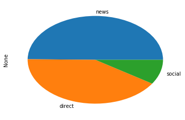
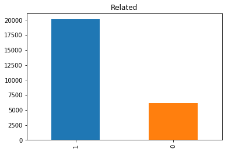

# Data Scientist Nanodegree

## Data Engineering

## Project: Disaster Response Pipeline

## Table of Contents

- [Introduction](#intro)
- [Project Components](#components)
  - [ETL Pipeline](#etl_pipeline)
  - [ML Pipeline](#ml_pipeline)
  - [Flask Web App](#flask)
- [Running](#run)
  - [Data Cleaning](#cleaning)
  - [Training Classifier](#training)
  - [Starting the Web App](#starting)
- [Required Libraries](#sw)
- [Acknowledgement](#acknowledgement)

***

<a id='intro'></a>

## 1. Project Overview

In this project, we apply data science to analyze disaster data and classify disaster messages.

_data_ directory contains a data set which are real messages that were sent during disaster events. A machine learning pipeline has been created to categorize these events so that appropriate disaster relief agency can be reached out for help.

This project will include a web app where an emergency worker can input a new message and get classification results in several categories. The web app will also display visualizations of the data.


<a id='components'></a>

## 2. Project Components

There are three components of this project:

<a id='etl_pipeline'></a>

### 2.1. ETL Pipeline

File _data/process_data.py_ contains data cleaning pipeline that:

- Loads the `messages` and `categories` dataset
- Merges the two datasets
- Cleans the data
- Stores it in a **SQLite database**



As we can tell from the above picture, alsmot half of the genre is news, greater than both direct and social.



Also, most of the messages are related.

<a id='ml_pipeline'></a>

### 2.2. ML Pipeline

File _models/train_classifier.py_ contains machine learning pipeline that:

- Loads data from the **SQLite database**
- Splits the data into training and testing sets
- Builds a text processing and machine learning pipeline
- Trains and tunes a model using GridSearchCV
- Outputs result on the test set
- Exports the final model as a pickle file

<a id='flask'></a>

### 2.3. Flask Web App

<a id='eg'></a>

Running [this command](#com) **from app directory** will start the web app where users can enter their query.

## 3. Running

There are three steps to get up and runnning with the web app if you want to start from ETL process.

<a id='cleaning'></a>

### 3.1. Data Cleaning

**Go to the project directory** and the run the following command:

```bat
python data/process_data.py data/disaster_messages.csv data/disaster_categories.csv data/DisasterResponse.db
```

The first two arguments are input data and the third argument is the SQLite Database in which we want to save the cleaned data. The ETL pipeline is in _process_data.py_.

_DisasterResponse.db_ already exists in _data_ folder but the above command will still run and replace the file with same information. 


<a id='training'></a>

### 3.2. Training Classifier

After the data cleaning process, run this command **from the project directory**:

```bat
python models/train_classifier.py data/DisasterResponse.db models/classifier.pkl
```

This will use cleaned data to train the model, improve the model with grid search and saved the model to a pickle file (_classifer.pkl_).

_classifier.pkl_ already exists but the above command will still run and replace the file will same information.


<a id='starting'></a>

### 3.3. Starting the web app

Now that we have cleaned the data and trained our model. Now it's time to see the prediction in a user friendly way.

**Go the app directory** and run the following command:

<a id='com'></a>

```bat
python run.py
```

This will start the web app and will direct you to a URL where you can enter messages and get classification results for it.

<a id='sw'></a>


## 4. Required Libraries

Besides the libraries included in the Anaconda distribution for Python 3.6 the following libraries have been included in this project:

*`nltk`

*`sqlalchemy`

<a id="acknowledgement"></a>
## 5. Acknowledgements

* [Udacity](https://www.udacity.com/) for providing this learning opportunity.
* [Figure Eight](https://www.figure-eight.com/) for providing the relevant dataset to train the model